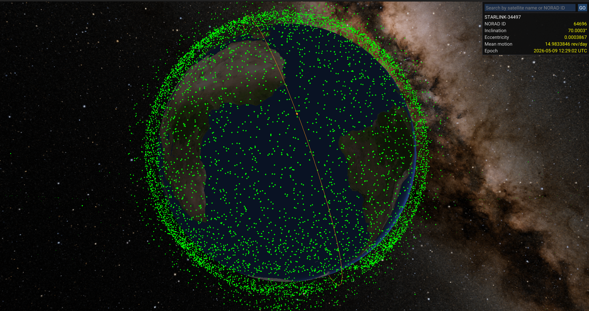

Visualization of satellites using SGP4 propagation, OpenGL and C++.

To build the project:
```bash
# Install tools to speed up compilation
sudo apt install mold ccache libssl-dev

# Development build setup
cmake -S . -B build -G Ninja -DCMAKE_BUILD_TYPE=Debug -DCMAKE_C_COMPILER_LAUNCHER=ccache -DCMAKE_LINKER_TYPE=MOLD
```

TODO:
- Stop hardcoding asset paths
    - Add a resource manager that'll verify the necessary files exist, map resource enum to actual paths, etc

- Render the predicted orbit of a satellite at a time

- Handle exceptions

- Port to WASM, release project, finish the project by **May 13**
